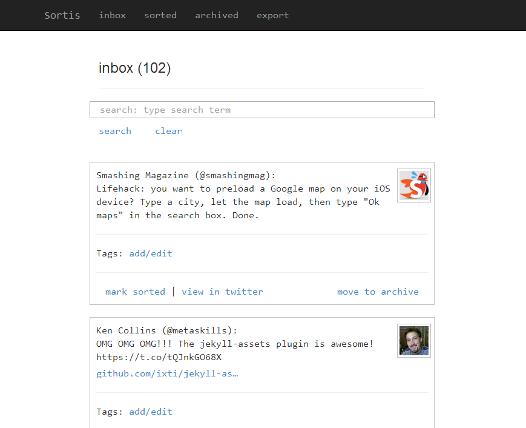
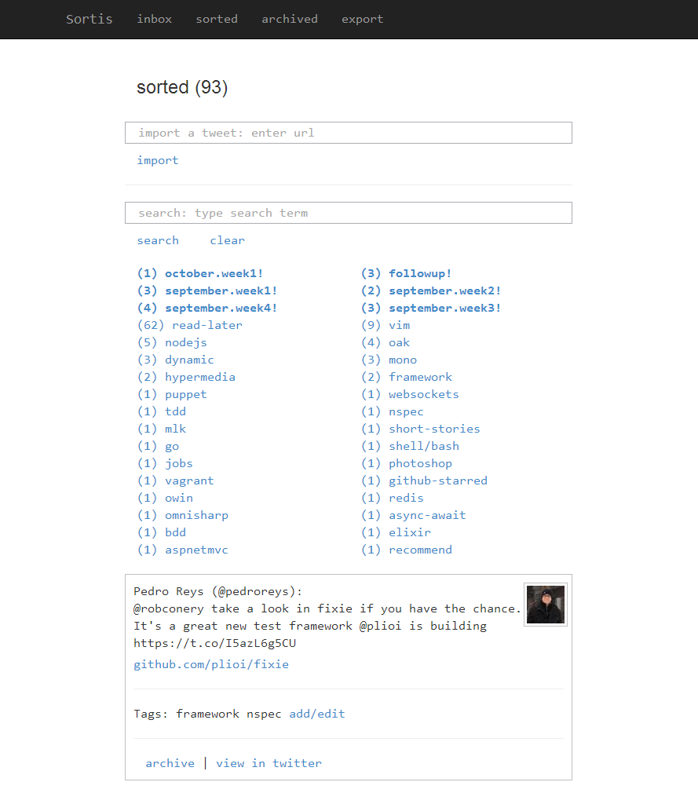
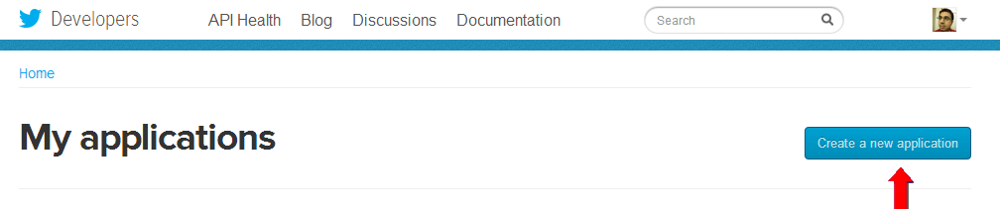
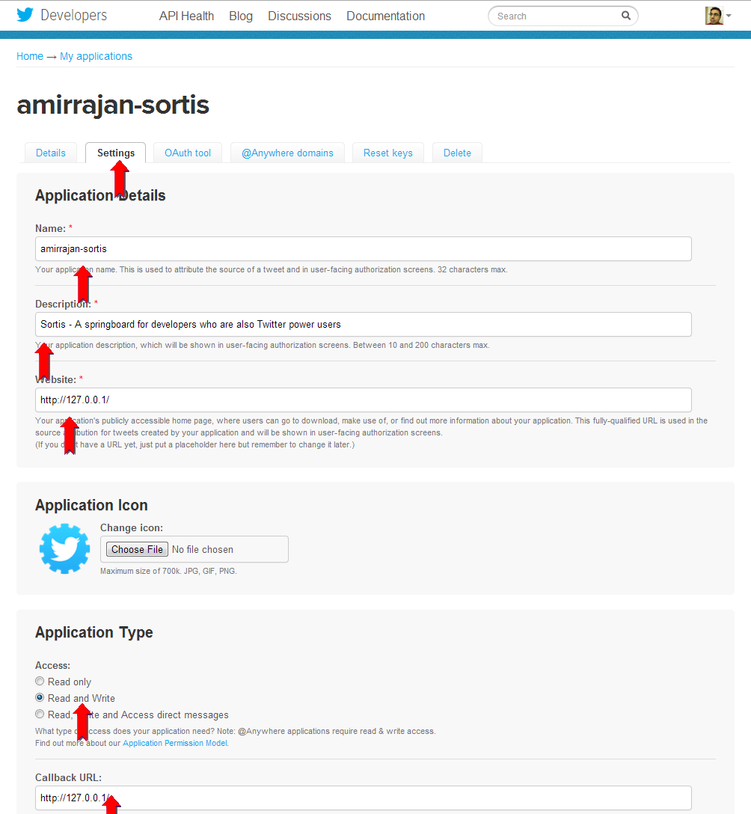
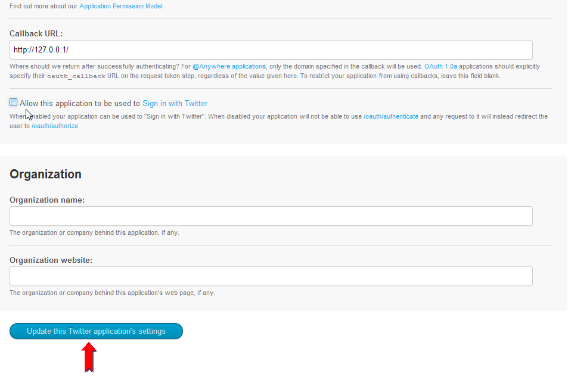
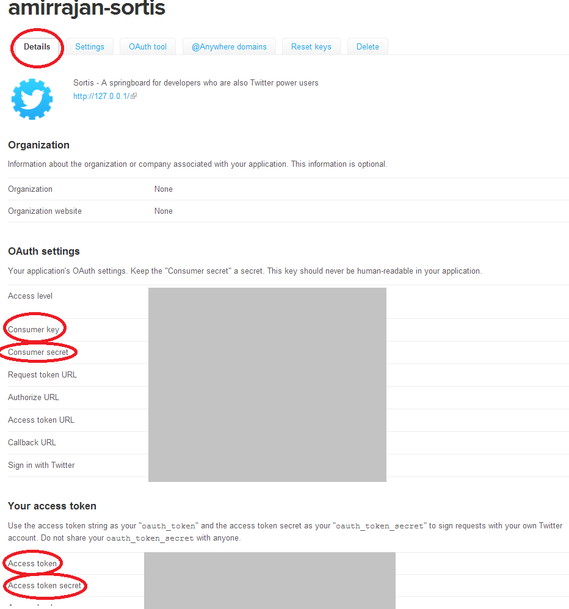

## Sortis - A twitter client for power users, and a springboard for developers

Sortis is a twitter client for managing the tweets you've favorited. More importantly, it's a springboard to create your own twitter based applications (and learn tech along the way).

Technology used: **NodeJS, AngularJS, ExpressJS, Redis, Twitter Rest Api's**

## It's for developers

This app isn't deployed anywhere for use by the public. It is meant to be deployed **by you, the developer**. Sortis is a single user application that you can deploy to the **NodeJS** provider of your choice (I've included instructions for deploying to Nodejitsu and Heroku). **You own the code and the data. Extend this app as you see fit. Make your own twitter mashups. Publish your code for others to learn, fork, extend and deploy**.

Sortis can be set up **freely** on cloud based offerings and trial accounts. You can run this entire app locally too if you don't want to subscribe to any (potentially) for-pay services.

## What Sortis does out of the box

I favorite quite a few tweets on twitter for different reasons. Things I want to read later, pairing sessions that I've scheduled, interesting projects that I've bookmarked...the list goes on. It suffices to say that the ability to just favorite a tweet wasn't enough anymore. Sortis, uses the tweets I've favorited as an "inbox" that I can then sort through, tag, search and archive.

Here is the inbox, this view uses [Twitter's Rest Apis](https://dev.twitter.com/docs/api/1.1) to retrieve tweets you've favorited:

Tweets can be sorted, tagged, and categorized. Once a tweet is sorted, the tweet is unfavorited from Twitter and stored entirely in your app (using [Redis](http://redis.io/)). Here is a screen shot of the sorted screen:

## Instructions for deploying your own Sortis

Go to http://nodejs.org and install NodeJS

Go to http://redis.io/download and install Redis

Then clone this repo:

    git clone https://github.com/amirrajan/sortis.git

And `cd` into the directory (all instructions below assume you are in the `sorits` directory:

    cd sortis

## Run Locally

Using a command prompt where `node` is available, run the following command to install all Sortis dependencies:

    npm install (you may need to prefix this with sudo if you're on Mac/Linux)

Register for a Twitter developer account: https://dev.twitter.com/user/login?destination=home

Under My Applications (https://dev.twitter.com/apps), create a new application:

Set up the application with the following settings. Anywhere you see amirrajan, replace that with your own twitter handle:

continued...

Once your twitter account is set up take the sample secret file located at `lib\secret.js.sample` and create `lib\secret.js`, update the twitter related values:

    //sample secret.js
    module.exports = {
        "consumerKey": "", //set this value from twitter
        "consumerSecret": "", //set this value from twitter
        "accessToken": "", //set this value from twitter
        "accessTokenSecret": "", //set this value from twitter
        "callBackUrl": "http://127.0.0.1/",
        "password": "", //no need for password when running locally
        "mobile": "",  //no need for mobile number when running locally
        "twilioAssignedPhoneNumber": "",  //no need for mobile number when running locally
        "twilioAccountSid": "", //no need for twilio values when running locally
        "twilioAuthToken": "", //no need for twilio values when running locally
        "redisPort": 6379, //no redis values are needed when running locally
        "redisMachine": "", //no redis values are needed when running locally
        "redisAuth": "", //no redis values are needed when running locally
        "enableAuth": false //two phase autorization is disabled when running locally
    };

Values are located on the detail page of Twitter:

At this point you'll should be able to run the app locally:

    node server.js

To view the app, go to `http://localhost:3000`, the code has a lot of comments. Crack it open and read :-) (start with `\server.js`)

### Running the app "in the cloud" 

### Securing the app with a two-phase auth

Given that this app is hard wired to your twitter account, it's best that you run the app with `enableAuth` set to `true`. With authorization enabled, you'll need to provide a password and an authorization code to access the site. If you get the password correct, a text message will be sent (via Twilio) to a mobile device you've specified in 
`secret.js`.

### Register a free account with Twilio

Sign up with a free Twilio account: https://www.twilio.com/try-twilio

Update `lib\secret.js`:

    //sample secret.js
    module.exports = {
        ....
        "password": "", //set a password (plain text)
        "mobile": "",  //this will be your mobile number, example: +15555551234
        "twilioAssignedPhoneNumber": "",  //phone number twilio assigns you: +15555554240
        "twilioAccountSid": "", //value provided by Twilio
        "twilioAuthToken": "", //value provided by Twilio
        ....
        "enableAuth": true //be sure this is to true when you deploy publicly
    };

Values are located here and here:

Once you've set these values up, try running the app locally with authorization enabled. After entering your password, you should receive a text message on your devise.

### Signing up and running Sortis on Nodejitsu

The documenation was available on the front page (right under the sign up for free button): https://www.nodejitsu.com/getting-started/

Install the Nodejitsu Package

    npm install jitsu -g (you may need to prefix this with sudo if you're on Mac)

Register via the command line:

    jitsu signup (yes you can sign up via the command line, which is awesome)

You'll get a confirmation email with a command to type in:

    jitsu users confirm [username] [confirmation-guid]

If you've already registered, you can login with:

    jitsu login

After you confirm your email, you can login (the `confirm` command should prompt you to log in).

Change the `subdomain` value in `package.json`, to reflect the url you want to deploy to:

    {
      "name": "sortis",
      [...],
      "subdomain": "amirrajan-sortis" <--- this value
    }

Create a redis database:

    jitsu databases create redis sortis

You'll get an output similar to this:

    info: Executing command databases create redis sortis
    info: A new redis has been created
    data: Database Type: redis
    data: Database Name: sortis
    data: Connection host: nodejitsu___________.redis._______.com
    data: Connection port: 6379
    data: Connection auth: nodejitsu___________.redis._______.com:__________

update the values in `secret.js`

    module.exports = {
        ...
        "redisPort": 6379, //Connection port value from output above
        "redisMachine": "", //Connection host value from output above
        "redisAuth": "", //Connection auth value from output above
        ...
    };

now deploy:

    jitsu deploy

note: if you add lib/secret.js to your .gitignore it will not be deployed and the app will not run. Ideally (once you get the hang of deploying this app), you'll want to move all the information in secret.js to environment variables in your production environment, for information on getting and setting environment variables for nodejitsu use `jitsu help env`.

Here is what secret.js may look like after migrating everything over to environment variables:

    module.exports = {
        "consumerKey": process.env.consumerKey,
        [...]
    }

And your app should be up on Nodejitsu now.

##Signing up and running Sortis on Heroku

From heroku.com, click Documentation, then click the Getting Started button, then click Node.js from the list of options on the left...which will take you here: https://devcenter.heroku.com/articles/nodejs 

Install Heroku toolbelt from here: https://toolbelt.heroku.com/

Sign up via the website (no credit card required).

Login using the command line tool:

    heroku login

Create your heroku app:

    heroku create

Add redis to your app

    heroku addons:add redistogo:nano

For heroku, the `redisPort`, `redisMachine`, `redisAuth` values in `secret.js` are not used (the Redis connection in Heroku is provided by an enviornment variable `process.env.REDISTOGO_URL`

Git deploy your app:

    git push heroku master

note: if you add lib/secret.js to your .gitignore it will not be deployed and the app will not run. Ideally (once you get the hang of deploying this app), you'll want to move all the information in secret.js to environment variables in your production environment, for information on getting and setting environment variables for heroku use `heroku help config`

Here is what secret.js may look like after migrating everything over to environment variables:

    module.exports = {
        "consumerKey": process.env.consumerKey,
        [...]
    }

Assign a dyno to your app:

    heroku ps:scale web=1

Open the app (same as opening it in the browser):

    heroku open

And your app should be up on Heroku.

### Running on Azure
(Todo) Links so far:

http://www.hanselman.com/blog/Over400VirtualMachineImagesOfOpenSourceSoftwareStacksInTheVMDepotAzureGallery.aspx
http://www.windowsazure.com/en-us/manage/linux/tutorials/virtual-machine-from-gallery/
http://richorama.github.io/AzurePluginLibrary/#APM
http://ossonazure.interoperabilitybridges.com/articles/how-to-deploy-redis-to-windows-azure-using-the-command-line-tool
http://stackoverflow.com/a/10190091 and http://coderead.wordpress.com/2012/10/12/pubsub-with-redis-on-azure/

